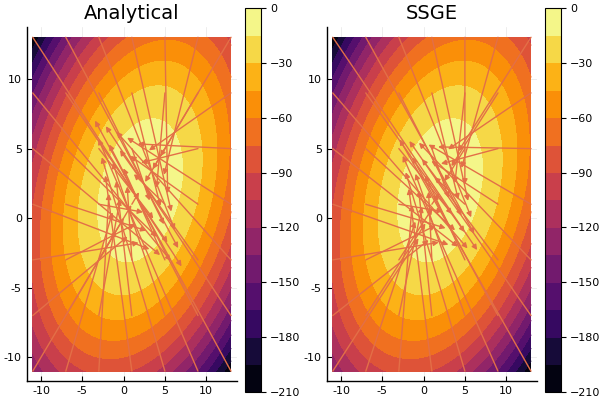
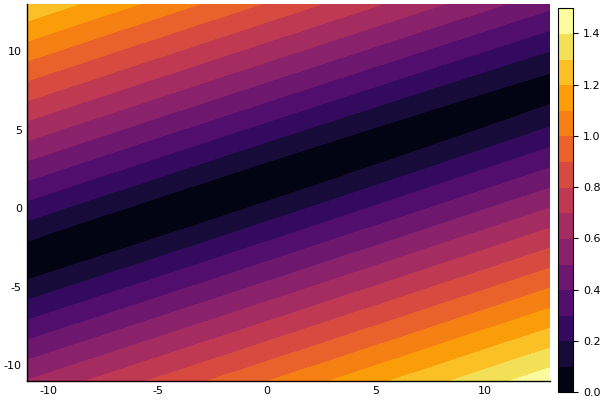

# SSGE - Spectral Stein Gradient Estimator

[](https://travis-ci.org/tpielok/SSGE.jl)
[](https://codecov.io/gh/tpielok/SSGE.JL)


A Julia implementation of the procedure described in 

Shi, Jiaxin and Sun, Shengyang and Zhu, Jun,
*A Spectral Approach to Gradient Estimation for Implicit Distributions*,
Proceedings of the 35th International Conference on Machine Learning,
4651--4660,
2018.

## Example - Multivariate Normal

The settings consist of

* 1000 samples,
* squared exponential with a bandwidth of 1000.0 as covariance kernel function,
* 3 eigenfunctions.

```julia
using Distributions, Random, ForwardDiff
import SSGE

test_dist = MvNormal([2, 2], Symmetric([1 0.3; 0.3 1]))
    
test_log_pdf(x) = log.(pdf(test_dist, x))
# Analytic solution
∇test_log_pdf(x) = ForwardDiff.gradient(test_log_pdf, x)
    
Random.seed!(1337)
num_samples = 1000
x_samples = rand(test_dist, num_samples)
num_eig_fun = 3
σ = 1000.0

∇appr_log_pdf = SSGE.SSGEstimator(x_samples, num_eig_fun, SSGE.SqExp(σ))

# Approximate solution at [2, 3]
∇appr_log_pdf([2.0, 3.0])
```
`2-element Array{Float64,1}:
  0.26720444111919184
 -1.0684837377977532 `
```julia
# Analytic solution at [2, 3]
∇test_log_pdf([2.0, 3.0])
```
`2-element Array{Float64,1}:
  0.32967039942741394
 -1.0989011526107788
`


<p align="center">

</p>

Display of the L2 norm of the differences of the gradients<!--- This is an HTML comment in Markdown , i.e.
$$||\nabla \log(q) - \tilde\nabla \log(q)||_2,$$
where $q \sim \mathcal{N}(\begin{bmatrix} 0 \\ 0 \end{bmatrix},
\begin{bmatrix} 1 & 0.3 \\ 0.3 & 1 \end{bmatrix})$ yields-->:

<p align="center">

</p>